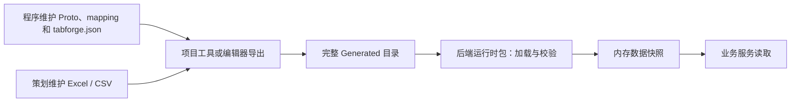

# 第三部分：后端第三方包接入

第三版覆盖 Go、Node.js/TypeScript、Java 和 Python。策划或编辑器仍用 `tabforge.json` 导出；后端复制完整 Generated 目录，安装运行时包，按数据路径读取。运行时不需要 Excel、Proto 源码、protoc 或 TabForge 命令行。

本文对应第三版代码 `1f6936a`，npm、Python、Java 包版本为 `0.3.0`。项目配置的 `version: 1` 和数据清单的 `tabforge.data.v1` 继续使用原格式编号，不需要改成 3。

## 1. 使用流程与分工



| 角色 | 维护内容 | 交付动作 |
| --- | --- | --- |
| 策划 | Excel / CSV 数据与项目约定的索引 | 使用第一部分的便携工具导出完整产物 |
| 前端 / 客户端程序 | Proto、字段映射、编辑器生成与导入 | 使用第二部分的插件，共享同一份 Generated |
| 后端程序 | 语言包依赖、产物放置位置、读取与更新逻辑 | 安装对应运行时包，启动时加载，业务中读取快照 |
| 工具维护者 | 导出器与 SDK 的构建 | 分发平台工具和语言包，提供版本记录 |

第一、二部分入口分别见 [项目工作流](project-workflow.md) 和 [编辑器工作流](editor-workflow.md)。复杂结构的填写规则、完整输入文件见 [完整示例](../examples/complete/README.md)。

第三部分提供配置数据加载与消息结构校验。涉及 HTTP 路由、鉴权或 SSE 时，继续使用 [前后端协议接入指南](protocol-integration.md)。数据清单里的 schemaHash 与网络协议包的 schemaHash 分别计算，不能用网络包的 hash 固定数据包。

## 2. 准备一次完整导出

从仓库根目录体验完整示例：

```bash
go run . -project=examples/complete
go run ./examples/complete/Clients/go
```

维护自己的项目时，程序先约定 Proto 和 mapping。下面的配置基于完整示例中的 `Protocols/`、`Tables/Index.csv` 和 `Tables/mapping.json`：

```json
{
  "version": 1,
  "output": "Generated",
  "schema": { "dir": "Protocols", "go": true },
  "tables": [{
    "index": "Tables/Index.csv",
    "mapping": "Tables/mapping.json",
    "outputs": {
      "protojson": "data/tables.json",
      "protobuf": "data/tables.pbb",
      "protobuf_dir": "data/by-table"
    }
  }]
}
```

`schema.go` 控制是否生成 Go 消息代码；仅使用 Node、Java、Python 时可设为 false。mapping 的 `root_message` 决定数据文件的根类型。表格、列名和字段映射必须配套，不能只复制配置而遗漏输入文件。

策划使用便携项目时，直接运行 `Tools/TabForge/Export.bat`（Windows）或 `Export.command`（macOS）。这些项目工具内置编译能力，不需要为导出安装 Go、Node 或 protoc；后端开发环境则按语言表安装自己的工具链。

## 3. Generated 的目录约定

后端项目示意，其他文件按所选语言放置：

```text
backend-app/
├── main.go / main.mjs / client.py / src/
└── Generated/
    ├── data_manifest.json
    ├── export.json
    ├── schema/
    │   ├── schema.pb
    │   ├── wire_schema.json
    │   ├── types.ts
    │   └── go/                    # schema.go 为 true 时生成
    └── data/
        ├── tables.json
        ├── tables.pbb
        └── by-table/
            ├── Item.pbb
            └── Settings.pbb
```

文件清单随配置变化，完整示例还会生成其他输出。`Open` / `open` 的目录参数指向 Generated；`Read` / `read` 的路径相对于该目录，传 `data/tables.json`，不再加 `Generated/` 前缀。加载目录参数可使用系统的绝对路径；清单内的路径使用 `/`，大小写必须与清单一致。

相对目录参数从后端进程的工作目录解析。服务从其他目录启动时，传入部署配置提供的绝对 Generated 路径。`decode` 接收内存中的 JSON 文本，不把参数当成文件路径。

### 清单与分发规则

```bash
go run . -project=examples/complete
```

新增 `Generated/data_manifest.json`：记录结构身份、描述文件、wire schema，以及每个已映射数据文件的路径、根消息、编码和 SHA-256。合并 ProtoJSON、合并 Protobuf 和按表 Protobuf 都登记；普通 V3 JSON、`.bin` 不登记到 Proto 数据清单。纯结构项目也生成清单，data 为 `[]`。

将完整 Generated 目录分发到后端。第一、二版产物需要用新工具重新导出，旧 `export.json` 格式和编辑器导入仍可用。只改变数据不会改变 schemaHash，文件校验值会改变；升级结构需要同步生成代码及全部产物。

| 清单字段 | 含义 |
| --- | --- |
| `format` | 当前数据格式 `tabforge.data.v1` |
| `schemaHash` | 描述的结构身份；数据变化不会改变它 |
| `descriptor.path / sha256` | Protobuf 描述文件及实际文件字节的校验值 |
| `wireSchema.path / sha256` | ProtoJSON 字段规则及实际文件字节的校验值 |
| `data[].path` | 可通过读取 API 访问的数据文件路径 |
| `data[].message` | 根消息的完整 Proto 名称，例如 `tabforge.demo.config.Tables` |
| `data[].encoding` | `protojson` 或 `protobuf` |
| `data[].sha256` | 该数据文件实际字节的校验值 |

清单由导出器生成，不手工修改。加载器会检查清单登记的所有文件，包括当前请求不准备读取的二进制文件；不能从包里单独删除它们。`data/by-table/Item.pbb` 仍以 `Tables` 为根，只包含本次表的对应字段，不能把它当作单个 `Item` 解码。

## 4. 选择并安装后端运行时

| 端 | 包入口 | 数据返回 | 最低目标 |
| --- | --- | --- | --- |
| Go | `github.com/Coder-is/TabForge/databundle` | 动态消息、生成消息；ProtoJSON / Protobuf | Go 1.26.6，项目工具链 1.26.8 |
| Node.js / TS | `@tabforge/protocol-runtime/node` | ProtoJSON 对象，TS 可绑定 MessageTypes | Node 24+；仅 ESM |
| Python | `tabforge-data` / `tabforge_data` | dict / list / 基础类型 | Python 3.9+；无运行时依赖 |
| Java | `io.tabforge:tabforge-data:0.3.0` | Gson JsonElement / JsonObject | Java 17+；Gson 2.13.2 |

Node、Java、Python 对清单中的二进制文件做完整性检查，但读取时要求选择 `.json` 数据。它们校验工具生成的规范 ProtoJSON；64 位整数始终是字符串。Go 使用官方 protobuf 解码，支持官方 ProtoJSON 输入形式及二进制。Java / Python 当前没有生成业务消息类或二进制编解码；动态结构来自同一 wire schema。

### 4.1 Go

第三版代码已推送到仓库。业务项目可固定到已验证的提交：

```bash
go get github.com/Coder-is/TabForge@1f6936a972615c402fe1570c4e7474201c3f2529
```

也可使用本地 `replace github.com/Coder-is/TabForge => /path/to/tabtoy`。维护者打包提供的 Go 源码 ZIP 只含运行时模块，解压后的 `tabforge-go/` 目录可作为 replace 目标。需要构建阶段 `project.Load` / `Export` 时，使用完整仓库。当前未创建 `v0.3.0` Git 标签，不要把 npm 的版本号直接作为 Go 已发布标签使用。

在业务项目中设置 Proto 的 `go_package`，再重新导出。例如业务 `go.mod` 为 `module example.com/mygame`，根消息文件可填写：

```proto
option go_package = "example.com/mygame/Generated/schema/go;configpb";
```

每个应用 Proto 都应设置自己的 go_package；跨文件 import 的包路径也应属于业务模块。复制示例到自己的项目后，需要重新生成 `.pb.go`，不要仅修改生成代码中的 import。

下面是该业务模块的完整 `main.go`，在模块根目录运行 `go run .`：

```go
package main

import (
    "fmt"
    "log"

    configpb "example.com/mygame/Generated/schema/go"
    "github.com/Coder-is/TabForge/databundle"
)

func main() {
    bundle, err := databundle.Open("Generated", "")
    if err != nil { log.Fatal(err) }
    var tables configpb.Tables
    if err := bundle.ReadInto("data/tables.pbb", &tables); err != nil {
        log.Fatal(err)
    }
    for _, item := range tables.Items {
        fmt.Printf("%s: ownerId=%d\n", item.Name, item.OwnerId)
    }

    // 动态消息不要求引入生成类型，也不要求手动填写根消息名。
    message, err := bundle.Read("data/tables.json")
    if err != nil { log.Fatal(err) }
    fmt.Println(message.ProtoReflect().Descriptor().FullName())
}
```

开启 `schema.go`，并把业务 Proto 的 `go_package` 设置为自己项目的模块路径。`ReadInto` 对比生成类型及依赖的描述，拒绝旧代码；失败不改写目标消息。`OpenFS(embedFS, "Generated", expectedHash)` 支持把完整产物嵌入服务；`DecodeJSON` / `DecodeBinary` 可校验结构中未被表格或 RPC 引用的消息。

### 4.2 Node.js / TypeScript

```bash
npm install /path/to/tabforge-protocol-runtime-0.3.0.tgz
```

包尚未发布到 npm registry。普通 JavaScript 创建 `main.mjs`，从后端项目根目录运行 `node main.mjs`：

```javascript
import { DataBundle } from '@tabforge/protocol-runtime/node';

const bundle = await DataBundle.open('Generated');
const tables = bundle.read('data/tables.json');
for (const item of tables.items ?? []) {
    console.log(`${item.name}: ownerId=${item.ownerId}`);
}
```

TypeScript 项目的 package.json 设置 `"type": "module"`，并安装编译工具：

```bash
npm install --save-dev typescript
```

最小 tsconfig.json：

```json
{
  "compilerOptions": {
    "target": "ES2022",
    "module": "NodeNext",
    "moduleResolution": "NodeNext",
    "strict": true,
    "outDir": "dist"
  },
  "include": ["main.ts", "Generated/schema/types.ts"]
}
```

创建 `main.ts`：

```typescript
import { DataBundle } from '@tabforge/protocol-runtime/node';
import type { MessageTypes } from './Generated/schema/types.js';

const bundle = await DataBundle.open<MessageTypes>('Generated');
const tables = bundle.read('data/tables.json', 'tabforge.demo.config.Tables');
console.log(tables.items?.[0].ownerId); // 字符串，保留 uint64 精度
```

TypeScript 将生成的 types.ts 编译为 types.js；这里只使用类型，不需要执行生成的 TypeScript。普通 JS 可直接 `bundle.read('data/tables.json')`。`/node` 独立使用 Node 文件系统，原 `/data` 继续供浏览器与编辑器使用。

在项目根目录执行 `npx tsc` 和 `node dist/main.js`。`read(path)` 的 TS 返回值为 unknown；传入第二个消息参数并绑定 `MessageTypes` 后，才能得到对应字段补全，运行时也会检查该消息是否与清单中的根消息一致。

### 4.3 Python

```bash
python -m pip install /path/to/tabforge_data-0.3.0-py3-none-any.whl
```

```python
from tabforge_data import DataBundle

bundle = DataBundle.open("Generated")
tables = bundle.read("data/tables.json")
print(tables["items"][0]["ownerId"])
```

默认字段可能省略；用 `dict.get` 读取可选字段。需要数字运算时显式 `int(value)`，Python 的整数可精确表示 uint64。`decode(message, text)` 可校验任意已生成的消息结构。

将上述代码保存为 `client.py`，从项目根目录执行 `python client.py`。Python 包尚未发布到 PyPI；Windows / macOS 使用同一个 wheel，在后端项目自己的 Python 环境中安装即可。预生成数据使用 UTF-8，接口保留可选字段是否存在，不主动补默认值。

### 4.4 Java

维护者提供 JAR 与 POM，先安装到本地 Maven 仓库：

```bash
mvn install:install-file -Dfile=/path/to/tabforge-data-0.3.0.jar -DpomFile=/path/to/tabforge-data-0.3.0.pom
```

业务 pom.xml 添加依赖：

```xml
<dependency>
  <groupId>io.tabforge</groupId>
  <artifactId>tabforge-data</artifactId>
  <version>0.3.0</version>
</dependency>
```

项目使用 Java 17 或更高，并启用支持 release 参数的编译插件；尚未配置的项目可加入下面的 properties / build：

```xml
<properties>
  <maven.compiler.release>17</maven.compiler.release>
  <project.build.sourceEncoding>UTF-8</project.build.sourceEncoding>
</properties>
<build>
  <plugins>
    <plugin>
      <groupId>org.apache.maven.plugins</groupId>
      <artifactId>maven-compiler-plugin</artifactId>
      <version>3.14.1</version>
    </plugin>
  </plugins>
</build>
```

JAR/POM 尚未发布到 Maven Central。也可在仓库执行 `mvn -f sdk/java/pom.xml install`，直接从源码安装本地包。

可直接编译的 `Client.java`，放入业务项目 `src/main/java/`：

```java
import io.tabforge.data.DataBundle;
import java.math.BigInteger;
import java.nio.file.Path;

public final class Client {
    public static void main(String[] args) throws Exception {
        var bundle = DataBundle.open(Path.of("Generated"));
        var tables = bundle.read("data/tables.json").getAsJsonObject();
        for (var element : tables.getAsJsonArray("items")) {
            var item = element.getAsJsonObject();
            var ownerId = item.has("ownerId")
                ? new BigInteger(item.get("ownerId").getAsString())
                : BigInteger.ZERO;
            var name = item.has("name") ? item.get("name").getAsString() : "";
            System.out.println(name + ": " + ownerId);
        }
    }
}
```

使用 `BigInteger` 处理 uint64 的数值运算，避免 `getAsLong` 溢出。Gson 由 Maven 解析；本项目使用 [Gson 严格 JSON 模式](https://google.github.io/gson/Troubleshooting.html)，并在读取时额外拒绝重复字段。

ProtoJSON 可省略默认值字段，因此访问 JsonObject 前先检查 has。上例在展示普通 uint64 时手动使用缺省值 0；optional 字段则应保留“未设置”与“显式零值”的区别。

编译并复制运行时依赖：

```bash
mvn package org.apache.maven.plugins:maven-dependency-plugin:3.8.1:copy-dependencies -DincludeScope=runtime
```

在项目根目录运行，macOS / Linux 使用 `java -cp "target/classes:target/dependency/*" Client`；Windows 使用 `java -cp "target/classes;target/dependency/*" Client`。

## 5. API 与结构约定

| 功能 | Go | Node / TS | Python | Java |
| --- | --- | --- | --- | --- |
| 从目录加载 | `databundle.Open(dir, hash)` | `await DataBundle.open(dir, hash)` | `DataBundle.open(dir, hash)` | `DataBundle.open(path, hash)` |
| 列出数据条目 | `bundle.Entries()` | `bundle.entries()` | `bundle.entries()` | `bundle.entries()` |
| 读取已登记数据 | `bundle.Read(path)` | `bundle.read(path)` | `bundle.read(path)` | `bundle.read(path)` |
| 强类型 / 消息检查 | `bundle.ReadInto(path, dst)` | `bundle.read(path, message)` | `bundle.read(path, message)` | `bundle.read(path, message)` |
| 校验 JSON 文本 | `bundle.DecodeJSON(message, bytes)` | `bundle.decode(message, text)` | `bundle.decode(message, text)` | `bundle.decode(message, text)` |
| 查询结构身份 | `bundle.SchemaHash()` | `bundle.schemaHash` | `bundle.schema_hash` | `bundle.schemaHash()` |
| 查询当前快照 | `store.Snapshot()` | `store.snapshot` | `store.snapshot` | `store.snapshot()` |

Node、Python 的 hash 参数和 Java `open(path)` 可省略；Go 的参数不能省略，不固定结构时传 `""`。Java `reload(path, hash)` 必须传 hash 参数。Node 调用加载和重新加载时需要 await，其他三端为同步调用。

| 结构 | 读取时的行为 |
| --- | --- |
| int64 / uint64 等 64 位整数 | JSON 三端为十进制字符串；Go 生成消息使用对应整数类型 |
| optional | 显式零值与未设置区分；JSON 用字段是否存在判断，Go 使用 presence |
| oneof | 同时填写多个成员会被拒绝，即使其中一个是零值 |
| repeated | JSON 中是数组；省略的默认字段可能不存在 |
| map | JSON 中是对象，整数 key 也是字符串；Go 使用消息对应的 map 类型 |
| enum | 已声明名称或 int32 数值；不存在的名称会被拒绝 |
| bytes | JSON 中是带填充的 Base64；Go 消息中是字节切片 |
| Timestamp / Duration / FieldMask | 保留规范 ProtoJSON 的字符串表示 |
| Struct / Value / Any | 按内建类型规则校验；Any 的类型必须来自已加载结构 |

仅生成结构时可以从配置删除 tables，清单的 data 为 `[]`。此时 `read` 没有可读取条目，但 `decode` 仍可用于校验任意已生成类型，例如 `tabforge.demo.structures.Tree`。

## 6. 加载、校验与重新加载

所有入口成功返回前，都会校验清单与登记文件的校验值，并校验全部 ProtoJSON。未知字段、oneof 冲突、错误类型、数值溢出、重复 JSON 键、错误路径、重复路径和文件缺失会使加载失败。Go 还独立重算描述的 schemaHash，并检查 wire schema 与描述一致。其他三端使用清单给出的 schemaHash 与文件校验值，不解析二进制描述。

每端可传 expectedHash 固定期望的结构身份；默认空字符串允许加载新的结构。校验值用于发现传输损坏或混合产物，不代替分发渠道的身份验证。

每次 `read` 返回独立数据；修改返回结果不会改动快照。Go `Store`、其他端 `DataStore` 都在新包完整加载成功后替换快照，失败保留旧快照；首个加载前 snapshot 为空。每个请求先取一次 snapshot，在请求期间使用同一个对象。并发 reload 的完成顺序决定最终快照；部署端应串行发布版本。目录替换过程中可能加载失败，等待导出完成后重试即可，正在使用的快照不依赖磁盘文件。

Go，放在业务初始化 / 更新逻辑中：

```go
var store databundle.Store
if err := store.Reload("Generated", ""); err != nil { return err }
expectedHash := store.Snapshot().SchemaHash()
if err := store.Reload("NextGenerated", expectedHash); err != nil {
    log.Printf("配置更新失败，继续使用旧快照：%v", err)
}
snapshot := store.Snapshot() // 当前请求只取一次
message, err := snapshot.Read("data/tables.json")
```

Node.js：

```javascript
import { DataStore } from '@tabforge/protocol-runtime/node';

const store = new DataStore();
await store.reload('Generated');
try {
    await store.reload('NextGenerated', store.snapshot.schemaHash);
} catch (error) {
    console.error('配置更新失败，继续使用旧快照', error);
}
const snapshot = store.snapshot;
const tables = snapshot.read('data/tables.json');
```

Python：

```python
from tabforge_data import DataStore

store = DataStore()
store.reload("Generated")
try:
    store.reload("NextGenerated", store.snapshot.schema_hash)
except (OSError, ValueError, KeyError) as error:
    print("配置更新失败，继续使用旧快照：", error)
snapshot = store.snapshot
tables = snapshot.read("data/tables.json")
```

Java，放在方法体内：

```java
var store = new io.tabforge.data.DataStore();
store.reload(Path.of("Generated"), "");
try {
    store.reload(Path.of("NextGenerated"), store.snapshot().schemaHash());
} catch (java.io.IOException | IllegalArgumentException error) {
    System.err.println("配置更新失败，继续使用旧快照：" + error.getMessage());
}
var snapshot = store.snapshot();
var tables = snapshot.read("data/tables.json");
```

这些示例固定原 schemaHash，适合只更新数据。需要升级结构时，同步部署新生成类型与数据包，再传新版本预期的 hash；第三版不自动做新旧结构兼容协商。

## 7. 常见错误排查

错误文本的大小写与措辞可能因语言不同；当前没有跨语言统一的错误编号，不要通过完全匹配文字决定业务行为。

| 错误 / 现象 | 常见原因 | 处理方法 |
| --- | --- | --- |
| 找不到 data_manifest.json | 指向项目根目录或拿到旧版 Generated | 指向 Generated；使用第三版工具完整重新导出 |
| Checksum mismatch | 只替换了部分文件，文件被编辑或传输不完整 | 重新分发完整目录，保留清单登记的全部文件 |
| Schema hash mismatch | expectedHash 属于其他结构或误用了网络协议 hash | 核对数据清单的 schemaHash 与发布版本 |
| Data file not declared | 路径前缀写错、大小写不一致，或文件未做 Proto 映射 | 查看 entries；使用清单中的 path |
| Message type mismatch | 指定的消息名与该文件根类型不同 | 使用 data[].message；按表 .pbb 也是合并根类型 |
| Destination generated schema mismatch | Go 生成代码与描述版本不一致 | 按业务 go_package 完整重新生成，并同步部署 |
| Unknown message / known message type | 消息不在已导出的结构中 | 核对完整 Proto 名称、入口及 imports |
| Invalid ProtoJSON / declared field | 未知字段、错误类型、oneof 或数值错误 | 根据错误中的字段路径修正源数据，再重新导出 |
| ProtoJSON only / unsupported encoding | JSON 三端读取了 .pbb 或读取旧 .bin | 选择对应 ProtoJSON 文件；Go 可读取登记的 .pbb |
| 重新加载后仍是旧数据 | 新包加载失败，旧快照按约定被保留 | 记录并修复加载错误；重新加载后再取 snapshot |
| 修改读取结果没有影响其他请求 | 读取 API 返回副本 | 修改源文件后重新导出、分发、reload |

第一次加载失败时尚无可用快照，服务应报告初始化失败。后续更新失败可以继续使用旧快照，并报告更新错误；是否重试由业务发布流程决定。

## 8. 维护者打包与验证

维护者需要 Go、Node/npm、Python（setuptools + wheel）、JDK 17 和 Maven。第三方包接入项目只需要自己的语言运行时及依赖。

```bash
go run ./cmd/package-backend -out=outputs/releases/v3
```

生成 Go 运行时源码 ZIP、npm tgz、Python wheel、Java JAR/POM 与 SHA256SUMS。支持 `-maven`、`-python`、`-npm` 指定工具及 `-maven-repo` 指定依赖缓存。未发布 registry、Maven Central、PyPI，也未创建 Git 标签。

| 交付文件 | 使用方式 |
| --- | --- |
| `tabforge-go-0.3.0.zip` | 解压，用内部的 tabforge-go 目录作为本地 Go replace 目标 |
| `tabforge-protocol-runtime-0.3.0.tgz` | npm install 本地文件 |
| `tabforge_data-0.3.0-py3-none-any.whl` | pip install 本地文件 |
| `tabforge-data-0.3.0.jar` 与同名 `.pom` | Maven 安装到本地仓库后声明依赖 |
| `SHA256SUMS` | 检查交付文件是否完整 |

在仓库根目录执行独立包消费验证：

```bash
python scripts/verify_backend.py --out=outputs/releases/v3
```

Java 不在 PATH 时传 `--java-home=/path/to/jdk`。脚本安装真实 tgz / wheel、以 JAR 编译独立 Java 消费端、通过源码 ZIP 接入独立 Go 模块，并在中文 / 空格目录下验证读取，写入 validation.json。该命令要求维护者构建环境，不能作为业务服务启动命令。

四端的可运行示例见 [后端示例](../examples/backend/README.md)。Node、Python、Java 共用 30 个规范结构用例；Go 验证动态 / 强类型、旧描述拒绝、embed 文件系统、并发读取和失败保持快照。CI 增加实际分发包消费验证。Windows 的三语言入口和 Go 竞态测试由 CI 覆盖，本机验证环境为 macOS ARM64；CI 配置本身不代表远端运行已完成。

2026-10-04 本地验证：完整 Go 竞态回归通过，包含 C# / Godot 读取链路；TS 严格检查与 30 项测试通过。Go 源码 ZIP、npm tgz、Python wheel、Java JAR 都在独立消费工程中安装并读取成功。20 个便携 / 编辑器归档及全部 25 个交付文件的校验值通过；解包后的三种编辑器内置 Mac ARM64 工具在空 PATH、中文与空格路径下完成生成、导入、校验及失败保持旧资产。记录在 `outputs/releases/v3/validation.json` 与 `client-validation.json`。

Windows / Intel 归档完成交叉编译及架构检查，尚未在对应系统实际执行；Unity、Creator、VS Code 的 UI 安装和按钮交互仍待验证。Mac 便携工具为未签名开发包。
